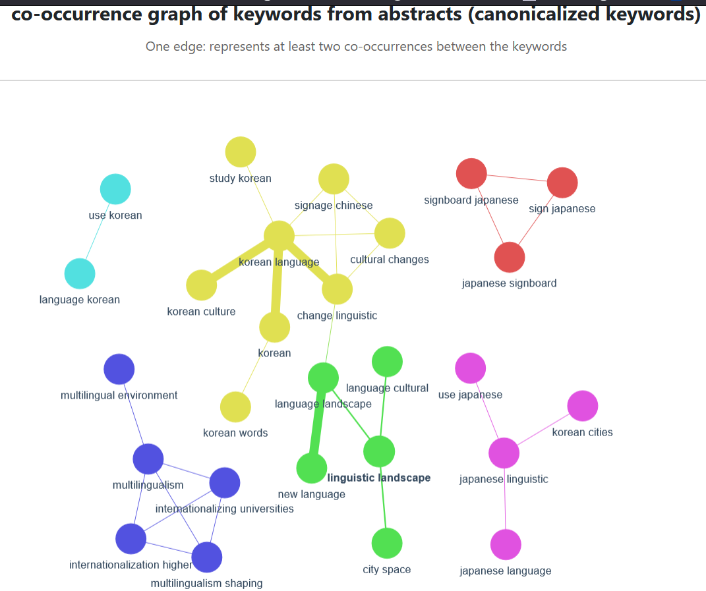

## Aims

### Purpose

The purpose is to have a synoptic view of academic trends related to linguistic landscape in Korea, and to identify related connected ``thematic`` clusters. 

I define a ``thematic`` as a collection of keywords relatively densely connected in a co-occurrence graph, a cluster. A co-occurrence graph is a graph representing a co-occurrence matrix.


### Goal

The goal is to analyze the correlation between keywords occuring together in paper abstracts of Korean articles related to ``linguistic landscape``. 

## Input data

``BibTeX``-like entries of metadata about Korean papers related to linguistics landscape, in a `.txt` file. The data harvesting step is out of the scope of this project.

Here is an example of obtained metadata for one article: 


```
Reference Type:  Journal Article
Record Number: 39
Author: 장인철
Year: 2024
Title: 언어경관을 통해 본 대학 국제화와 다중언어주의
Journal: 인문학연구
Pages: 51-96
Short Title: 언어경관을 통해 본 대학 국제화와 다중언어주의
ISSN: 2671-8847<br />1229-5485
Abstract:[...] This paper examines the impacts of this sociocultural change on the sociolinguistic environments within internationalizing universities, with a specific focus on the role of multilingualism in shaping linguistic landscape. [...]
```

Around one hundred articles metadata are collected.

## Problem

Some papers already have keywords supplied in the abstract, which can be retrieved through the BibTex-like metadata. However, it's not the case most of the time. 
Keywords related to a paper can be supplied/typed manually, but this is time-consuming. That's why I automate this process by generating "artificial" keywords based on the provided abstract. 

## Solution proposal

To generate keywords from an abstract, I use ``KeyBERT``, which is a keyword extractor based on the ``BERT`` architecture, which is a Language Model. ``KeyBERT`` only works for english text, so I have to filter the abstracts to only keep the english ones.

### Exact-Match co-occurrence computing

Once we have keywords for each article, I consider the co-occurrences of those keywords per article. For example, let's consider that ``article 1`` is associated with keywords ``A``, ``B``, and ``C``. and ``article 2`` is associated with keywords ``A``, ``B``, and ``D``. Considering those two articles, the co-occurrence of ``A`` with ``B`` (or ``B`` with ``A``) is two.

However, one major issue is that keywords are "too unique", in the sense that _stricto sensu_ co-occurrences are too rare. It is clear that ``linguistics`` and ``linguistic`` are basically the same keywords, though they are wrongly considered to be different,  because their ``String`` representation are different. The direct consequence of it is a co-occurrence matrix that is too sparse.

Sparse matrices result in sparsely connected graphs, which can hinder the detection of meaningful clusters, which doesn't enough highlight the correlation between thematic clusters related to linguistic landscape.


### Canonicalization of co-occurrences

To solve this problem, I preprocess keywords using a ``lemmatization`` technique. Then, I group together keywords that are semantically close to each other under what I call a ``umbrella keyword``, that is more generic (I call this process `canonicalization`). 

Here is an example:

```json     
"linguistic landscape": [
        "linguistic landscape",
        "proposes linguistic",
        "city linguistic",
        "interpretation landscape",
        "interpretation land",
        "semiotics street"
```

In this example, multiple keywords are associated under the _umbrella keyword_ ``linguistic landscape``. This canonicalization. process is done by encoding the semantic meaning of keywords using ``all-MiniLM-L6-v2`` (a Language Model), and comparing obtained encodings using a _cosine similarity_ metric. The idea behind is that similar semantic encodings (mathematically) are representing similar keywords (semantically).

The grouping of keywords under an umbrella keyword is controlled by a parameter ``threshold``, which is a float between 0 and 1.  the threshold value is selected based on empirical tests to balance specificity and generality of umbrella keywords.

The closer ``threshold`` is to zero, the fewer umbrella words (In the extreme case where the threshold value equals zero, all keywords are grouped under a single umbrella word.). The closer ``threshold`` is to one, the more umbrella words (In the extreme case where the threshold value equals one, each keyword is its own umbrella word)

Only considering umbrella keywords reduces the dimensions of the co-occurrence matrix, and makes it more dense (in other words, it reasonably simplifies the problem).

## Results

Results can be visualized using a co-occurrence graph: 





The thicker the edge, the higher the co-occurrence between the keywords are, within the given input data (metadata articles).

Each color represents a thematic cluster. Clusters can be identified using a ``Louvain clustering`` algorithm, which compute the partition of the graph that maximizes its modularity (be taking into account the density of edges connected to nodes).

As you can see, the dark blue cluster is mostly about multilingualism, whereas the yellow one is mostly about Koran language


